Welcome to **LeRobotDepot**. This repository is listing open-source hardware, components, and 3D-printable projects compatible with the [LeRobot library](https://github.com/huggingface/lerobot). It helps users easily discover, build, and contribute to affordable, accessible robotics solutions powered by state-of-the-art AI.

## Table of Contents

- [Feetech Family](#feetech-family)
  - [Robot Arms](#robot-arms)
  - [Bi-manual Arms](#bi-manual-arms)
  - [Mobile Arms](#mobile-arms)
  - [Mobile Bi-manual Arms](#mobile-bi-manual-arms)
  - [Humanoid Robots](#humanoid-robots)
  - [Grippers & Accessories](#grippers--accessories)
  - [Track Axis](#track-axis)
- [Dynamixel Family](#dynamixel-family)
  - [Robot Arms](#robot-arms-dynamixel)
  - [Bipedal Robots](#bipedal-robots)
- [Common Accessories & Add-ons](#common-accessories--add-ons)
  - [Task Kits](#task-kits)
  - [Other Accessories](#other-accessories)
- [Teleoperation](#teleoperation)
- [Cameras](#cameras)
- [Contributing](#contributing)

---

# Feetech Family

Hardware in this family uses **Feetech motors**—specifically, the STS3215 series available in both 7.4V and 12V variants. These motors are popular for their balance between performance and cost:
- **7.4V Version:** Typically offers a stall torque of approximately 16.5 kg·cm at 6V. This option is often sufficient for basic robotics applications.
- **12V Version:** Delivers around 30 kg·cm of stall torque, providing increased power for more demanding tasks.
  
By standardizing on the STS3215, projects in the Feetech Family maintain similar power and control characteristics, ensuring compatibility across accessories and modules.

## Robot Arms:

### [TheRobotStudio/SO-ARM100](https://github.com/TheRobotStudio/SO-ARM100)

This **5 DOF arm** is the recommended arm to get starte with LeRobot—especially the 5V version.

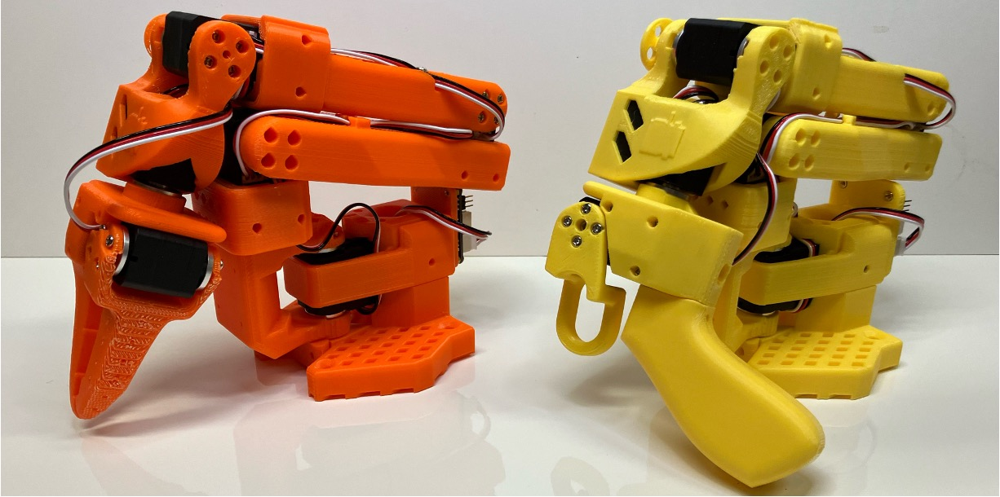

|             Price         | US    | EU    | RMB       |
|---------------------------|-------|-------|-----------|
| Follower and Leader arms  | $232  | €244  | ￥1343.16 |
| One Arm                   | $123  | €128  | ￥682.23  |

#### Accessories 

For detailed information on the various accessories available for the SO-ARM100, including mounting options and additional components, please refer to the [SO-ARM100 repository’s hardware documentation](https://github.com/TheRobotStudio/SO-ARM100?tab=readme-ov-file#hardware).

##### Wrist Cameras

The SO-ARM100 supports multiple wrist camera options to suit a variety of applications. There are three officially supported options and one community-developed alternative:

| Camera Name           | Reference Link                                                                                     |
|-----------------------|----------------------------------------------------------------------------------------------------|
| Vinmooog Webcam       | [Instructions](https://github.com/TheRobotStudio/SO-ARM100/tree/main/Optional/Wrist_Cam_Mount_Vinmooog_Webcam) |
| 32x32mm UVC Module    | [Instructions](https://github.com/TheRobotStudio/SO-ARM100/tree/main/Optional/Wrist_Cam_Mount_32x32_UVC_Module) |
| RealSense™ D405       | [Instructions](https://github.com/TheRobotStudio/SO-ARM100/tree/main/Optional/Wrist_Cam_Mount_RealSense_D405) |
| RealSense™ D435       | [STL Files](https://www.thingiverse.com/thing:6981459)                         |

##### Haptic Sensors

- [WOWROBO Haptic sensor](https://shop.wowrobo.com/products/enhanced-anyskin-premium-crafted-editionwowskin)

##### Others
- [SO-ARM100 electronics mounting cover](https://grabcad.com/library/so100-arm-electronics-mounting-cover-and-stereo-cam-holder-1)

#### Kits

You can find kits for the SO100 arms here:  
- [Seeed Studio](https://www.seeedstudio.com/SO-ARM100-3D-printed-Enclosure-p-6409.html)  
- [WOWROBO](https://shop.wowrobo.com/products/so-arm100-diy-kit-assembled-version)  
- [Phospho](https://robots.phospho.ai)  

Both **assembled** and **non-assembled** kits are available, depending on the supplier.

---

### [jess-moss/moss-robot-arms](https://github.com/jess-moss/moss-robot-arms)
This **5 DOF arm** is similar to the SO-ARM100 but uses only the gripper as a 3D printed part. It is recommended to build or purchase the SO100 arm instead. While the Moss v1 robot is still supported, it will be deprecated. Additionally, 3D-printed parts for the SO-ARM100 are now available for purchase if you don't have a printer.

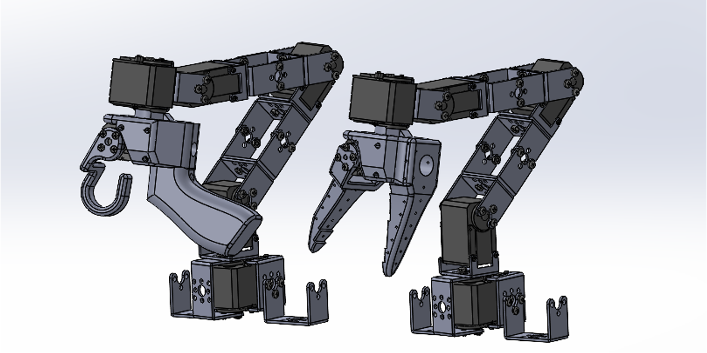

|        Price              | US    | EU    | RMB       |
|---------------------------|-------|-------|-----------|
| Follower and Leader arms  | $288  | €274  | ￥1631.46 |
| One Arm                   | $159  | €153  | ￥868.13  |

#### Accessories

See [SO-ARM100 Accessories](#therobotstudioso-arm100) for compatible components and mounts.

---

### [ajinkyagorad/SO-ARM107](https://github.com/ajinkyagorad/Lerobot-SO100-Arm/tree/777a90975373a8f5e9e56d468a24ab3dc5916ea4/hardware)

This is a **6 DOF arm**, based on the SO-ARM100 leader and follower arms, with an additional joint enabled by one more STS3215 servo motor.

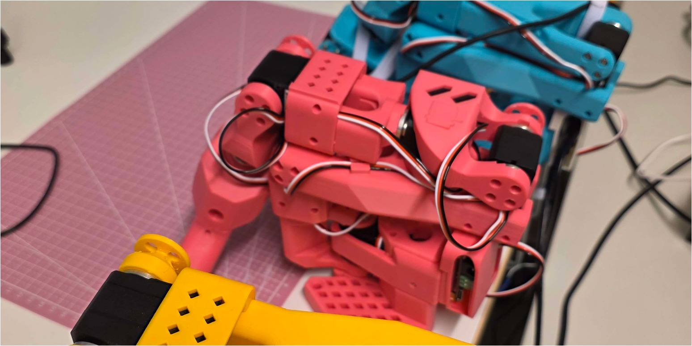

#### Price

The price is roughly equivalent to the SO-ARM100, plus the cost of one extra Feetech servo motor—either 7.4V or 12V, depending on your chosen configuration.

#### Accessories

For wrist cameras, haptic sensors, and other modules, see [SO-ARM100 Accessories](#so-arm100-accessories) for compatible components.

---

### SAM arm

This is a **6 DOF arm**, developed by the community around the [SimpleAutomation repository](https://github.com/SimpleAutomationOrg/SimpleAutomation). It is a refined version of the SO-ARM100, offering enhanced movement precision and a gripper better optimized for handling small objects.

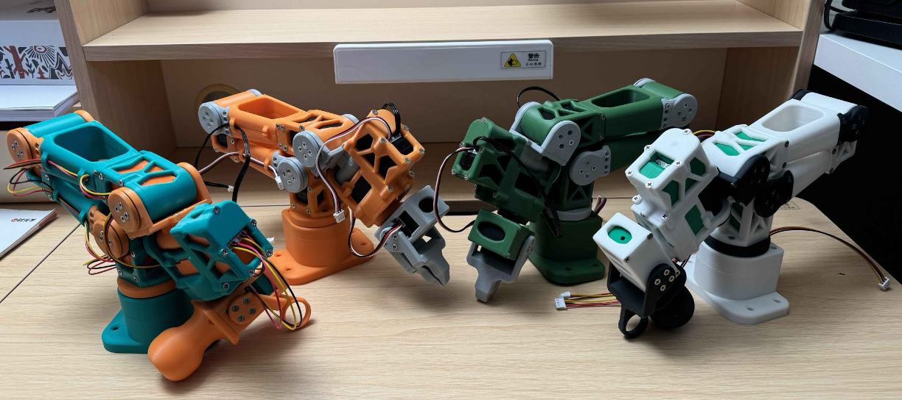

- [Discord Channel](https://t.co/pPVt7dVbnJ)
- [Discorn message on Bill Of Materials](https://discord.com/channels/1306427593586901092/1308906584239243274/1324588976312684595)
- [Discorn message on Beta v1.1 STEP files](https://discord.com/channels/1306427593586901092/1308906584239243274/1336551154368253972)

|        Price              | US    |
|---------------------------|-------|
| Follower and Leader arms  | ± $450|

#### Accessories

N/A

---

## Bi-manual Arms

---

## Mobile Arms

### [SIGRobotics-UIUC/LeKiwi](https://github.com/SIGRobotics-UIUC/LeKiwi)
Mobile version of the SO-ARM100.

| Price              | US      | EU      |
|--------------------|---------|---------|
| 12V                | $488.21 | €542.56 |
| 5V                 | $524.95 | €525.9  |
| Base only (5V)     | $251.95 | €306.9  |
| Base only (12V)    | $257.43 | €305    |
| Base only wired    | $174    | €233.3  |

---

## Mobile Bi-manual Arms

### [timqian/bambot](https://github.com/timqian/bambot)

Mobile version of the SO-ARM100 with two arms.

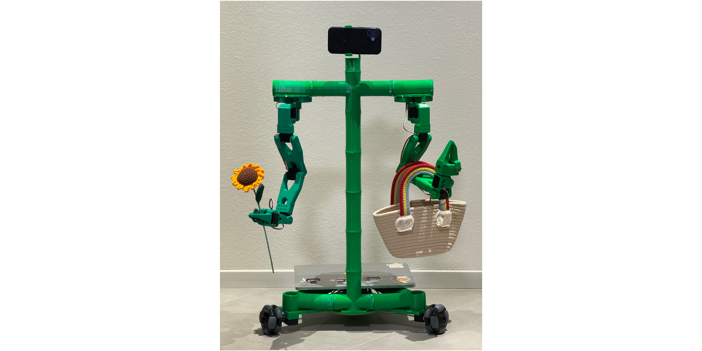

|              Price        | US     | EU     | RMB       |
|---------------------------|--------|--------|-----------|
| Total                     | ~ $300 | ~ €300 | ~ ￥2000 |

---

## Humanoid Robots

### [TheRobotStudio/HOPEJr](https://github.com/TheRobotStudio/HOPEJr)
A project for a full body robot—currently featuring the torso and arms.

---

## Grippers & Accessories

### [pollen-robotics/PincOpen](https://github.com/pollen-robotics/PincOpen)

Parallel-finger gripper compatible with SO-ARM100.

#### Price:
~€25

---

### [Chojins/LeRobot-S0-100-Models](https://github.com/Chojins/LeRobot-S0-100-Models)

Precise gripper compatible with SO-ARM100.

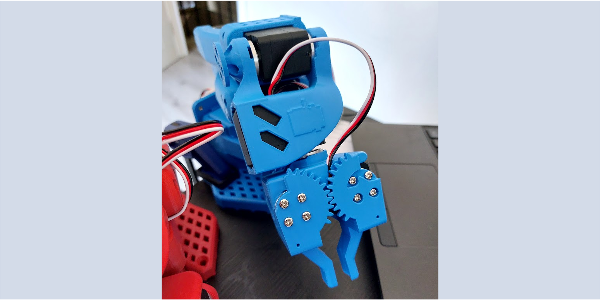

---

### [avenhaus/SO-ARM100-Track-Axis](https://github.com/avenhaus/SO-ARM100-Track-Axis)

---
# Dynamixel Family

## Robot Arms:

### [jess-moss/koch-v1-1](https://github.com/jess-moss/koch-v1-1)

If you want to familiarise yourself with more industry standard Dynamixel servo motors, this project could be a good starting point. Compared to the SO-ARM100, you will have less torque and a more limited range of movement from its base.

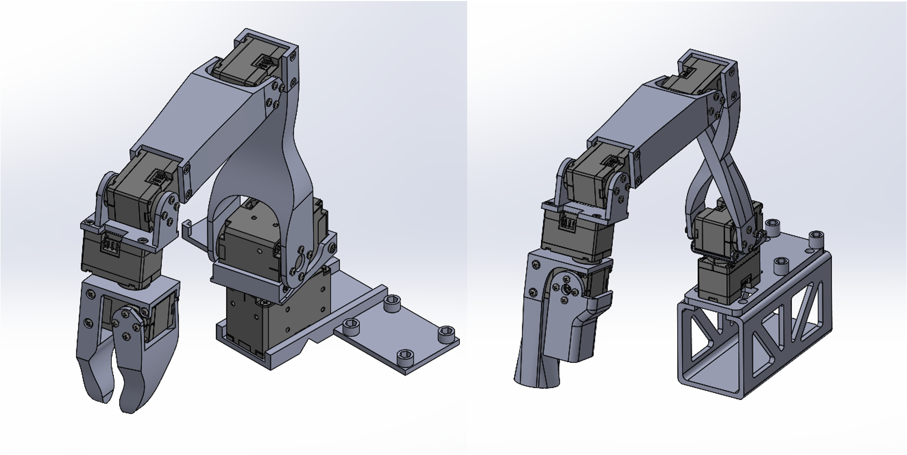

|         Price           | US    | EU    | UK    | RMB  | JPY   |
|-------------------------|-------|-------|-------|------|-------|
| Follower and Leader arms| $477  | €673  | £507  | ¥3947 | ¥22439 |
| Leader Arm              | $278  | €368  | £285  | ¥2251 | ¥15446 |
| Follower Arm            | $199  | €305  | £222  | ¥1696 | ¥6993  |

#### Motor Types:
- Dynamixel XL430
- Dynamixel XL330-M288-T
- Dynamixel XL330-M077-T

#### Wrist Cameras
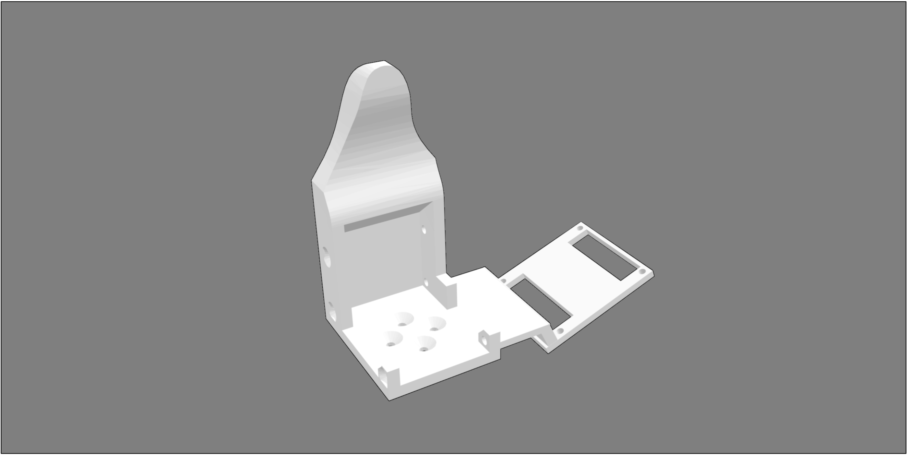

[Discord Message source](https://discord.com/channels/1216765309076115607/1243077809828790363/1311493401157304350) 

#### Kits
- Robotic arm inspired by Kochv-1-1: [WOWROBO Twinarm](https://shop.wowrobo.com/products/wowrobo-twinarm-robotic-arm-set-inspired-by-koch-v1-1)
- Gripper with Camera kit for Koch-v1-1: [WOWROBO Gripper-Camera Kit](https://shop.wowrobo.com/products/gripper-camera-kit-for-koch-v1-1)
- Haptic sensors for Koch-v1-1 gripper: [Enhanced AnySkin](https://shop.wowrobo.com/products/enhanced-anyskin-premium-crafted-editionwowskin)

---

## Bipedal Robots

### [apirrone/Open_Duck_Mini](https://github.com/apirrone/Open_Duck_Mini)

Miniature version of the BDX Droid by Disney.

---

# Common Accessories & Add-ons

## Task kits

### [cgreer/robot-task-kit](https://github.com/cgreer/robot-task-kit)

- "T" for push T task.
- A "toaster" with 2 pieces of "toast".
- A paper towel base & rod + paper towel roll.
- Cube.
- Ring.

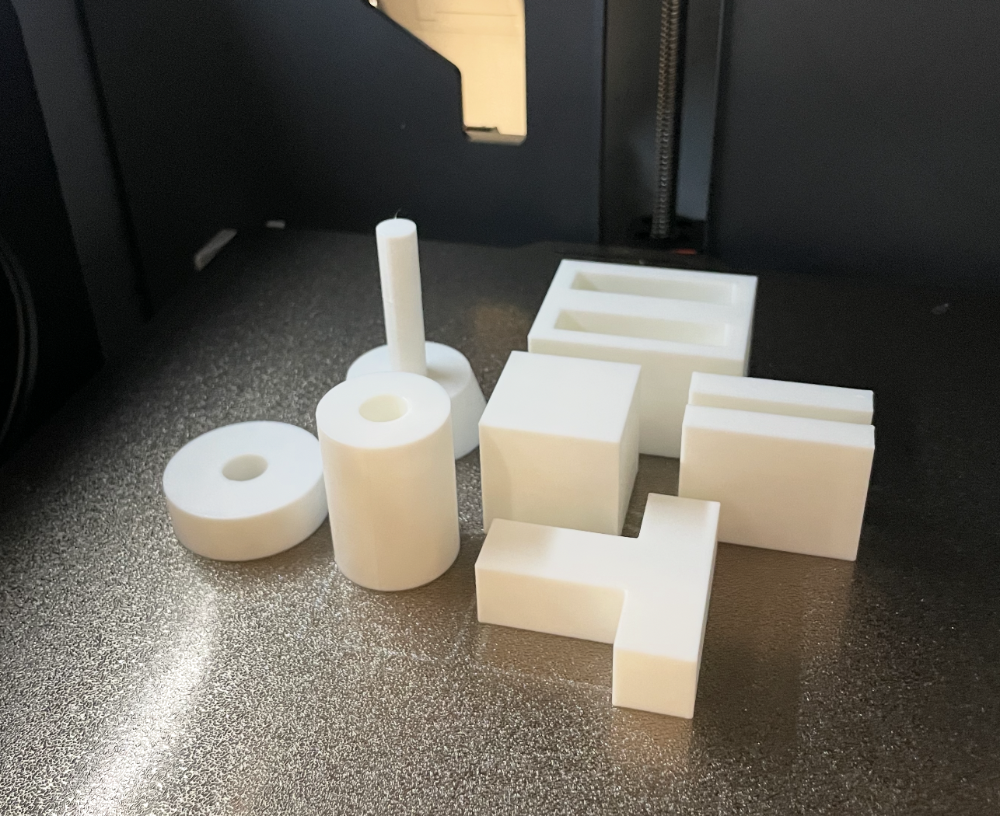

---

### [Hugging Face rectangular prism](https://github.com/jess-moss/koch-v1-1/tree/main/hardware/extras/STL)

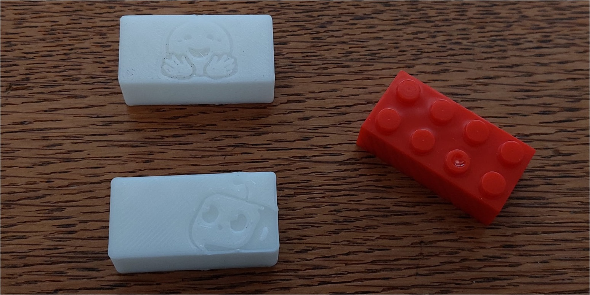

---

## Other

### [Self-Fusing Silicone Rubber](https://www.3m.com/3M/en_US/p/d/b00011950/)
To increase friction on gripper.
  
  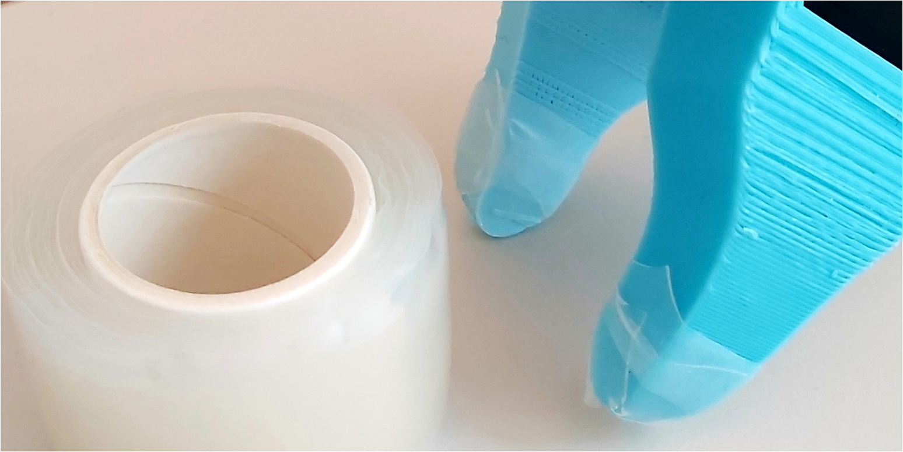

---

# Teleoperation

## [max-titov/finger-tracker](https://github.com/max-titov/finger-tracker)

Hardware that attaches to the back of your hand and fingertips that tracks 16 degrees of freedom.

---

# Cameras

| Name                     | Price Range      | Link | Resolution | FPS  | Wide Angle                                   | Microphone |
|--------------------------|------------------|------|------------|------|----------------------------------------------|------------|
| Innomaker 1080P USB2.0    | ± $18, €16       | [Innomaker Link](https://www.inno-maker.com/product-category/products/uvc-cameras/low-cost/) | 1920×1080  | 30   | Fov(D) = 130°   Fov(H) = 103°              | No         |
| Innomaker 720p USB2.0     | ± $10, €14       | [Innomaker Link](https://www.inno-maker.com/product-category/products/uvc-cameras/low-cost/) | 1280×720   | 30   | FOV (D) = 120°   FOV (H) = 102°             | No         |
| Innomaker OV9281 USB 2.0  | ± $36, €42       | [Innomaker Link](https://www.inno-maker.com/product/u20cam-9281m/) | 1280×800   | 120  | FOV Up to 148°                               | No         |
| Vinmooog Webcam          | ± $14, €12       | [Amazon Link](https://www.amazon.nl/-/en/Microphone-Adjustable-Conference-Streaming-Compatible/dp/B0BG1YJWFN/) | 1920×1080  | N/A  | N/A                                          | Yes        |

## Others
- https://www.amazon.co.uk/ELP-Conferencing-Fisheye-0-01Lux-Computer/dp/B08Y1KY5T9?th=1
- https://www.amazon.com/dp/B07CSJN2KH

---

# Contributing

Interested in contributing? Please take a moment to review our [CONTRIBUTING.md](CONTRIBUTING.md) for guidelines on how to get started.

