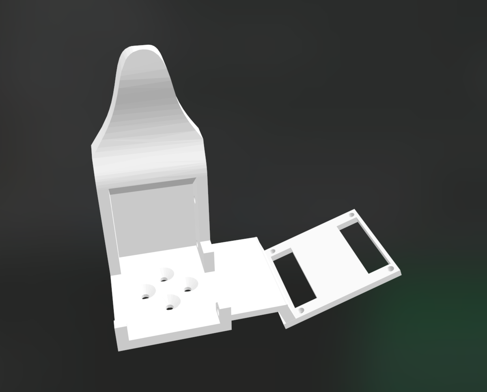

LeRobotDepot is a community-driven repository listing open-source hardware, components, and 3D-printable projects compatible with the LeRobot library. It helps users easily discover, build, and contribute to affordable, accessible robotics solutions powered by state-of-the-art AI.

## Table of Contents

- [5 DOF arms](#5-dof-arms)
  - [TheRobotStudio/SO-ARM100](#therobotstudioso-arm100)
  - [jess-moss/koch-v1-1](#jess-mosskoch-v1-1)
  - [jess-moss/moss-robot-arms](#jess-mossmoss-robot-arms)
- [6 DOF arms](#6-dof-arms)
  - [ajinkyagorad/SO-ARM107](#ajinkyagoradso-arm107)
  - [SAM arm](#sam-arm)
- [Mobile robot arms](#mobile-robot-arms)
  - [SIGRobotics-UIUC/LeKiwi](#sigrobotics-uiuc-lekiwi)
  - [timqian/bambot](#timqianbambot)
- [Grippers](#grippers)
  - [pollen-robotics/PincOpen](#pollen-roboticspincopen)
  - [Chojins/LeRobot-S0-100-Models](#chojinslerobot-s0-100-models)
  - [Gripper accessories](#gripper-accessories)
- [Task kits](#task-kits)
  - [cgreer/robot-task-kit](#cgreerrobot-task-kit)
  - [Hugging Face rectangular prism](#hugging-face-rectangular-prism)
- [Track Axis](#track-axis)
  - [avenhaus/SO-ARM100-Track-Axis](#avenhausso-arm100-track-axis)
- [Full body robot (currently only torso and arms)](#full-body-robot-currently-only-torso-and-arms)
  - [TheRobotStudio/HOPEJr](#therobotstudiohopejr)
- [Finger Teleoperation](#finger-teleoperation)
  - [max-titov/finger-tracker](#max-titovfinger-tracker)
- [Two legs robot](#two-legs-robot)
  - [apirrone/Open_Duck_Mini](#apirroneopen-duck-mini)
- [Cameras and mounts](#cameras-and-mounts)
  - [Cameras](#cameras)
  - [SO-ARM100 compatible](#so-arm100-compatible)
  - [Koch-V1-1 compatible](#koch-v1-1-compatible)
- [Footnotes](#footnotes)

# 5 DOF arms:

## [TheRobotStudio/SO-ARM100](https://github.com/TheRobotStudio/SO-ARM100)

The 5V version is the first recommendation to start with LeRobot.

### Price:
|                           | US    | EU    | RMB       |
|---------------------------|-------|-------|-----------|
| Follower and Leader arms  | $232  | 244€  | ￥1343.16 |
| One Arm                   | $123  | 128€  | ￥682.23  |

### Motor Types:
- STS3215 7.4V or,
- STS3215 12V[1](#myfootnote1).

The 7.4V has a stall torque of 16.5kg.cm at 6V (and likely slightly less for a 5V power supply). The 12V version has a stall torque of 30kg.cm. While we found the 7.4V to be sufficient, if you would like more powerful motors you can buy the 12V version.

### Kits
You can find kits for the SO100 arms here:
- Seeed Studio [Bazaar](https://www.seeedstudio.com/SO-ARM100-3D-printed-Enclosure-p-6409.html) or [Taobao](https://item.taobao.com/item.htm?id=878010637397&skuId=5915703371829&spm=a213gs.v2success.0.0.4cbf4831mkqWLn).
- [WOWROBO](https://shop.wowrobo.com/products/so-arm100-diy-kit-assembled-version) (They include **assembled** versions!)

Additionally, you can find the SO100 follower arm kit (without the leader arm) on [Phospho](https://robots.phospho.ai). It can be especially useful if you own a VR headset.

### Accessories

- [SO100 arm electronics mounting cover](https://grabcad.com/library/so100-arm-electronics-mounting-cover-and-stereo-cam-holder-1)

## [jess-moss/koch-v1-1](https://github.com/jess-moss/koch-v1-1)
If you want to familiarise yourself with more industry standard Dynamixel servo motors, this project could be a good starting point. Compared to the SO-ARM100, you will have less torque and a more limited range of movement from its base.

### Price:
|                         | US    | EU    | UK    | RMB  | JPY   |
|-------------------------|-------|-------|-------|------|-------|
| Follower and Leader arms| $477  | 673€  | 507£  | ¥3947 | ¥22439 |
| Leader Arm              | $278  | 368€  | £285  | ¥2251 | ¥15446 |
| Follower Arm            | $199  | 305€  | £222  | ¥1696 | ¥6993  |

### Motor Types:
- Dynamixel XL430
- Dynamixel XL330-M288-T
- Dynamixel XL330-M077-T

### Kits
- Robotic arm inspired by Kochv-1-1: [WOWROBO Twinarm](https://shop.wowrobo.com/products/wowrobo-twinarm-robotic-arm-set-inspired-by-koch-v1-1)
- Gripper with Camera kit for Koch-v1-1: [WOWROBO Gripper-Camera Kit](https://shop.wowrobo.com/products/gripper-camera-kit-for-koch-v1-1)
- Haptic sensors for Koch-v1-1 gripper: [Enhanced AnySkin](https://shop.wowrobo.com/products/enhanced-anyskin-premium-crafted-editionwowskin)

## [jess-moss/moss-robot-arms](https://github.com/jess-moss/moss-robot-arms)
The moss-robot-arms project is similar to the SO-ARM100 but uses only the gripper as a 3D printed part. It is recommended to build or purchase the SO100 arm instead. While the Moss v1 robot is still supported, it will be deprecated. Additionally, 3D-printed parts for the SO-ARM100 are now available for purchase if you don't have a printer.

### Price:
|                           | US    | EU    | RMB       |
|---------------------------|-------|-------|-----------|
| Follower and Leader arms  | $288  | 274€  | ￥1631.46 |
| One Arm                   | $159  | 153€  | ￥868.13  |

### Motor Types:
- STS3215 7.4V or,
- STS3215 12V[1](#myfootnote1).

# 6 DOF arms:

### [ajinkyagorad/SO-ARM107](https://github.com/ajinkyagorad/Lerobot-SO100-Arm/tree/777a90975373a8f5e9e56d468a24ab3dc5916ea4/hardware)

SO-ARM100 leader and follower arms with an extra joint using 7 STS3215 servos.

### SAM arm

Developed by the community around the [SimpleAutomation repository](https://github.com/SimpleAutomationOrg/SimpleAutomation), this refined version of the SO-ARM100 offers enhanced movement precision and a gripper specifically optimized for handling small objects.

- [Discord Channel](https://t.co/pPVt7dVbnJ)
- [Discorn message on Bill Of Materials](https://discord.com/channels/1306427593586901092/1308906584239243274/1324588976312684595)
- [Discorn message on Beta v1.1 STEP files](https://discord.com/channels/1306427593586901092/1308906584239243274/1336551154368253972)

### Price:
|                           | US    |
|---------------------------|-------|
| Follower and Leader arms  | ± $450|

### Motor Types:

* STS3215 12V

# Mobile robot arms

## [SIGRobotics-UIUC/LeKiwi](https://github.com/SIGRobotics-UIUC/LeKiwi)
Mobile version of the SO-ARM100.

### Price:

| Price| US  | EU  |
|---------|----:|----:|
| 12V |  $488.21  |  €542.56  |
| 5V  |  $524.95  |  €525.9  |
| Base only (5V) |  $251.95  |  €306.9  |
| Base only (12V) |  $257.43  |  €305  |
| Base only  wired |  $174  |  €233.3  |

### Motor Types:
- STS3215 7.4V or,
- STS3215 12V[1](#myfootnote1).

## [timqian/bambot](https://github.com/timqian/bambot)

Mobile version of the SO-ARM100 with two arms.

### Price:
|                           | US    | EU    | RMB       |
|---------------------------|-------|-------|-----------|
| Total  | ~$300  | ~€300  | ~￥2000 |

### Motor Types:
- STS3215 12V.

# Grippers

## [pollen-robotics/PincOpen](https://github.com/pollen-robotics/PincOpen)

## [Chojins/LeRobot-S0-100-Models](https://github.com/Chojins/LeRobot-S0-100-Models)

## Gripper accessories

- **Self-Fusing Silicone Rubber** to increase friction on gripper: [3M Product Page](https://www.3m.com/3M/en_US/p/d/b00011950/)
  
  

- **Tactil sensor**: [WOWROBO Tactil Sensor](https://shop.wowrobo.com/products/enhanced-anyskin-premium-crafted-editionwowskin)

# Task kits

## [cgreer/robot-task-kit](https://github.com/cgreer/robot-task-kit)

- "T" for push T task.
- A "toaster" with 2 pieces of "toast".
- A paper towel base & rod + paper towel roll
- Cube
- Ring

## [Hugging Face rectangular prism](https://github.com/jess-moss/koch-v1-1/tree/main/hardware/extras/STL)

# Track Axis

## [avenhaus/SO-ARM100-Track-Axis](https://github.com/avenhaus/SO-ARM100-Track-Axis)

# Full body robot (currently only torso and arms)

## [TheRobotStudio/HOPEJr](https://github.com/TheRobotStudio/HOPEJr)

# Finger Teleoperation

## [max-titov/finger-tracker](https://github.com/max-titov/finger-tracker)

Hardware that attaches to the back of your hand and fingertips that tracks 16 degrees of freedom.

  
  

# Two legs robot

## [apirrone/Open_Duck_Mini](https://github.com/apirrone/Open_Duck_Mini)

Miniature version of the BDX Droid by Disney.

<table>
  <tr>
    <td></td>
    <td></td>
    <td></td>
  </tr>
</table>

# Cameras and mounts

## Cameras

| Name | Price Range | Link | Resolution | FPS | Wide Angle | Microphone |
|-------------|-------------|------|------------|-----|----------|----|
| Innomaker 1080P USB2.0 | ± $18, 16€ | [Innomaker Link](https://www.inno-maker.com/product-category/products/uvc-cameras/low-cost/)| 1920×1080 | 30 | Fov(D) = 130 degrees   Fov(H) = 103 degree | No |
| Innomaker 720p USB2.0 | ± $10, 14€ | [Innomaker Link](https://www.inno-maker.com/product-category/products/uvc-cameras/low-cost/)| 1280×720 | 30 | FOV (D) = 120 degrees   FOV (H) = 102 degrees | No |
| Innomaker OV9281 USB 2.0 | ± $36, 42€ | [Innomaker Link](https://www.inno-maker.com/product/u20cam-9281m/) | 1280×800 | 120fps | FOV Up to 148 degrees | No |
| Vinmooog Webcam | ± $14 , 12€| [Amazon Link](https://www.amazon.nl/-/en/Microphone-Adjustable-Conference-Streaming-Compatible/dp/B0BG1YJWFN/ref=sr_1_4?dib=eyJ2IjoiMSJ9.bXxh9SmjG8ZYOfNQMZu293elZsc0Hb_TTa-4XnQnXXO7dv_DRP_95twr0NzDuvVfdhS0fEaBljJBxHBXQMOniv_sGKN-QbYbVeqwqQ92L9YEFE3gcUFrqI3XDTJf5vnVuSxyNzaUVUPy74ctHq8QcGUXShPSIJ6NB9nFy5fz1GNbnQKnibXOkGLzilAzLfW7PzJ8mEW-M3pv9KIaRTk2LkxGsR6rDtjJCklWyazqQey7SsqWxE4PrFID5-k8LUiX3rw7lpKwD8RCcS1grPyNIzZkVKNoq858KSN33nlTg4fY2Ay4ctC9S5N6AjsJ2mX4PL4RDkCca7-r7B5KvKhvArjr184j5LcqLGSXPqzfLMU.cWjDiG8qd8h66qrPqykMCLGpcZcXHO2GPmLas6wD8dg&dib_tag=se&qid=1742508496&refinements=p_4%3AVinmooog&s=electronics&sr=1-4) |1920×1080| N/A | N/A |Yes

### Others
- https://www.amazon.co.uk/ELP-Conferencing-Fisheye-0-01Lux-Computer/dp/B08Y1KY5T9?th=1
- https://www.amazon.com/dp/B07CSJN2KH?ref=cm_sw_r_cp_ud_dp_SMPW5DPZ46Z2TFQ24PEJ&ref_=cm_sw_r_cp_ud_dp_SMPW5DPZ46Z2TFQ24PEJ&social_share=cm_sw_r_cp_ud_dp_SMPW5DPZ46Z2TFQ24PEJ&_encoding=UTF8&peakEvent=2&dealEvent=0&skipTwisterOG=1&th=1 

## SO-ARM100 compatible
- [Mount for innomaker 1080P USB2.0](https://github.com/TheRobotStudio/SO-ARM100/blob/main/Optional/Camera_Holder_Alternate_MF)
- [Mount for Vinmooog Webcam](https://github.com/TheRobotStudio/SO-ARM100/tree/main/Optional/Camera_Holder)
- [Mount for Intel realsense support](https://www.thingiverse.com/thing:6981459)

## Koch-V1-1 compatible

[Discord Message source](https://discord.com/channels/1216765309076115607/1243077809828790363/1311493401157304350) 

# Footnotes

<a name="myfootnote1">1</a>: The 7.4V has a stall torque of 16.5kg.cm at 6V (and likely slightly less for a 5V power supply). The 12V version has a stall torque of 30kg.cm. While we found the 7.4V to be sufficient, if you would like more powerful motors you can buy the 12V version.
