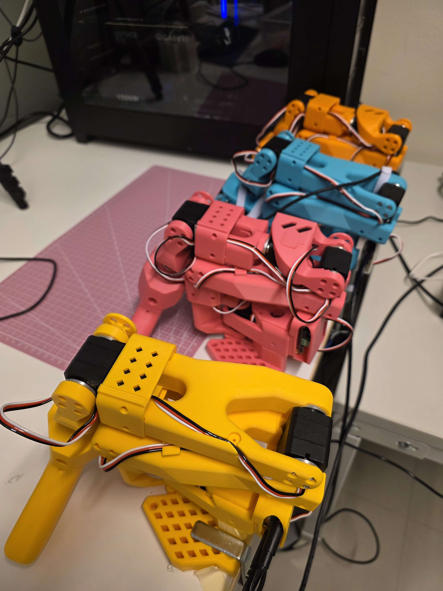
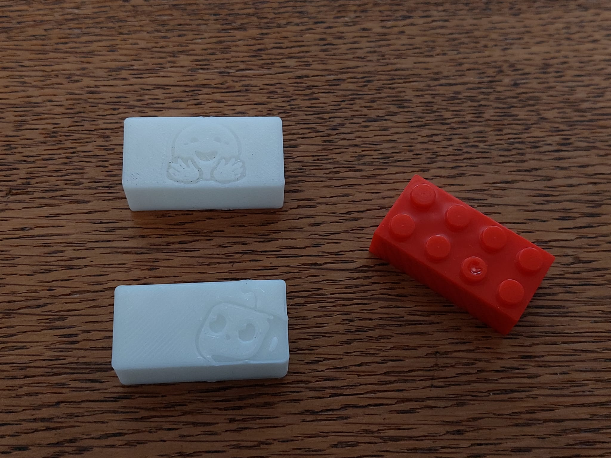
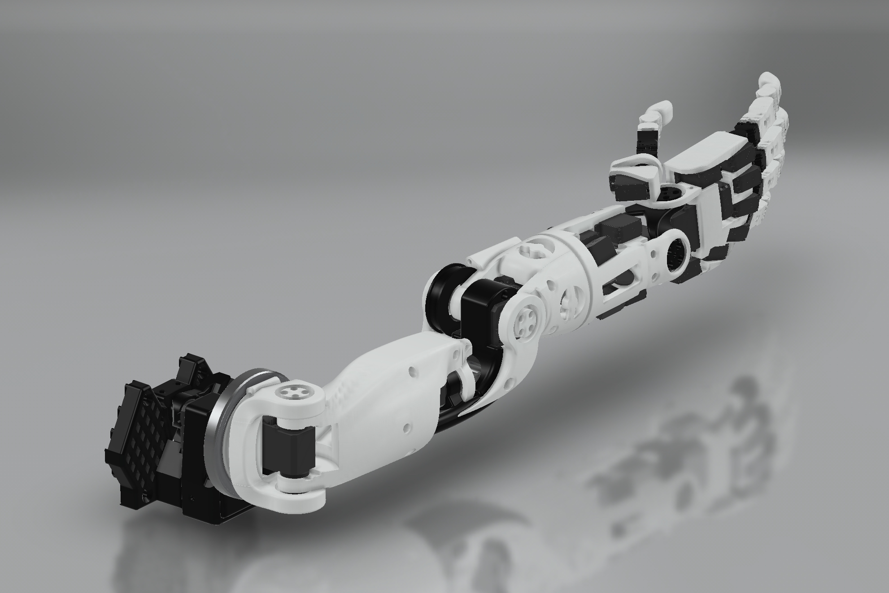
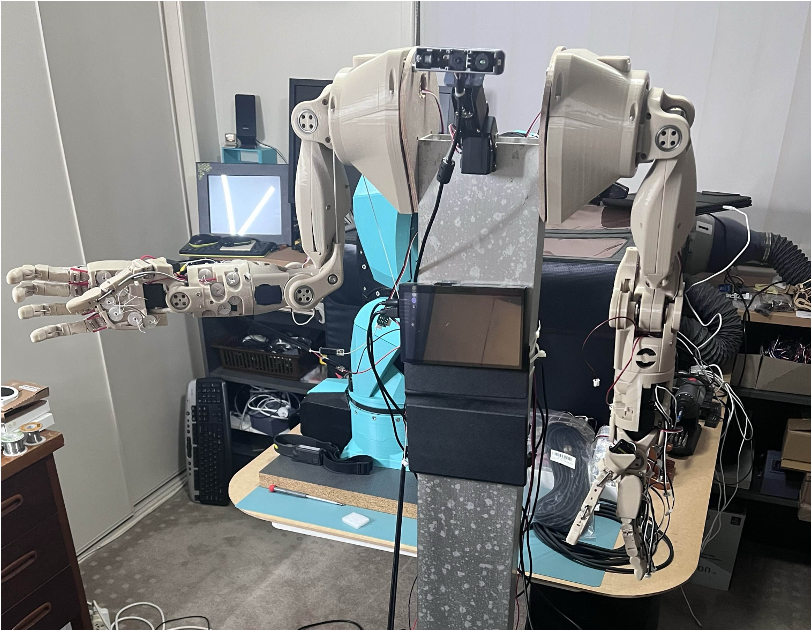

LeRobotDepot is a community-driven repository listing open-source hardware, components, and 3D-printable projects compatible with the LeRobot library. It helps users easily discover, build, and contribute to affordable, accessible robotics solutions powered by state-of-the-art AI.

# 6 DOF arms:

## [TheRobotStudio/SO-ARM100](https://github.com/TheRobotStudio/SO-ARM100)

The 5v version is the first recommandation to start with LeRobot.

### BOM:
| | US | EU | RMB |
|-|----|----|-----|
| Follower and Leader arms | $232 | 244€ | ￥1343.16 | 
| One Arm| $123 | 128€ | ￥682.23 |

### Motor Types:
- STS3215 7.4V or,
- STS3215 12V[1](#myfootnote1).

The 7.4V has a stall torque of 16.5kg.cm at 6V (and likely slightly less for a 5V power supply). The 12V version has a stall torque of 30kg.cm. While we found the 7.4V to be sufficient, if you would like more powerful motors you can buy the 12V version.

### Kits
You can find kits for the SO100 arms here:
- Seeed studio [Bazaar](https://www.seeedstudio.com/SO-ARM100-3D-printed-Enclosure-p-6409.html) or [Taobao](https://item.taobao.com/item.htm?id=878010637397&skuId=5915703371829&spm=a213gs.v2success.0.0.4cbf4831mkqWLn).

- [WOWROBO](https://shop.wowrobo.com/products/so-arm100-diy-kit-assembled-version) (They include **assembled** versions!)

Additionally you can find SO100 follower arm kit (without leader arm) on [Phospho](https://robots.phospho.ai). It can be especially useful if you own a VR headset.

## [jess-moss/koch-v1-1](https://github.com/jess-moss/koch-v1-1)
If you want to familiarise with more industry standard Dynamixel servo motors. This could a a good project to start with. Compared to the SO-ARM100, you will have less torkes and a more limited range of movement from his base.

### BOM:
| | US | EU | UK | RMB | JPY |
|-|----|----|-----|----|-----|
| Follower and Leader arms | 477$ | 673€ | 507£ | ¥3947 | ¥22439
| leader Arm| $278 | 368€ | £285 | ¥2251 | ¥15446
| Follower Arm | $199 | 305€ | £222 | ¥1696 | ¥6993

### Motor Types:

- Dynamixel XL430
- Dynamixel XL330-M288-T
- Dynamixel XL330-M077-T

### Kits

- Robotic arm inspired by Kocchv1-1: https://shop.wowrobo.com/products/wowrobo-twinarm-robotic-arm-set-inspired-by-koch-v1-1
- Gripper with Camera kit for koch-v1-1: https://shop.wowrobo.com/products/gripper-camera-kit-for-koch-v1-1
- Haptic sensors for koch-v1-1 gripper: https://shop.wowrobo.com/products/enhanced-anyskin-premium-crafted-editionwowskin

## [jess-moss/moss-robot-arms](https://github.com/jess-moss/moss-robot-arms)
The moss-robot-arms is similar to the SO-ARM100 but use only the gripper as 3D printed part. It is recommanded to build or purchase the SO100 arm instead. While the Moss v1 robot is still supported, it will be deprecated. Additionally, 3D-printed parts for the SO-ARM100 are now available for purchase if you don't have a printer.

### BOM:
| | US | EU | RMB |
|-|----|----|-----|
| Follower and Leader arms | $288 | 274€ | ￥1631.46 | 
| One Arm| $159 | 153€ | ￥868.13 |

### Motor Types:
- STS3215 7.4V or,
- STS3215 12V[1](#myfootnote1).

# 7 DOF arms:

### [ajinkyagorad/SO-ARM107](https://github.com/ajinkyagorad/Lerobot-SO100-Arm/tree/777a90975373a8f5e9e56d468a24ab3dc5916ea4/hardware)

SP-ARM100 leader and follower arms with extra joint using 7 STS3215 servos. 

# Mobile robot arms
## [SIGRobotics-UIUC/LeKiwi](https://github.com/SIGRobotics-UIUC/LeKiwi)

  

## [timqian/bambot](https://github.com/timqian/bambot)

    

# Grippers
## [pollen-robotics/PincOpen](https://github.com/pollen-robotics/PincOpen)

## [Chojins/LeRobot-S0-100-Models](https://github.com/Chojins/LeRobot-S0-100-Models)

# gripper accessories
- **Self-Fusing Silicone Rubber** to increase friction on gripper: https://www.3m.com/3M/en_US/p/d/b00011950/

- **Tactil sensor**: https://shop.wowrobo.com/products/enhanced-anyskin-premium-crafted-editionwowskin

# Task kits

## [cgreer/robot-task-kit](https://github.com/cgreer/robot-task-kit)

- "T" for push T task.
- A "toaster" w/ 2 pieces of "toast".
- A paper towel base&rod + paper towel roll (humanity must master this! We can do it!)
- Cube
- Ring

## [Huggingface rectangular prism](https://github.com/jess-moss/koch-v1-1/tree/main/hardware/extras/STL)

 

# Track Axis
## [avenhaus/SO-ARM100-Track-Axis](https://github.com/avenhaus/SO-ARM100-Track-Axis)

# Full body robot (currently only torso and arms)

## [TheRobotStudio/HOPEJr](https://github.com/TheRobotStudio/HOPEJr)

  

# Finger Teleoperation

## [max-titov/finger-tracker](https://github.com/max-titov/finger-tracker)

Hardware that attaches to the back of your hand and fingertips that tracks 16 degrees of freedom.

  
   

# Mobile robot

## [apirrone/Open_Duck_Mini](apirrone/Open_Duck_Mini)

Miniature version of the BDX Droid by Disney.

<table>
  <tr>
    <td> </td>
    <td> </td>
    <td> </td>
   </tr> 
</table>

# Cameras and mounts
- https://github.com/TheRobotStudio/SO-ARM100/blob/main/Optional/Camera_Holder_Alternate_MF
https://github.com/TheRobotStudio/SO-ARM100/tree/main/Optional/Camera_Holder

# Footnotes

<a name="myfootnote1">1</a>: The 7.4V has a stall torque of 16.5kg.cm at 6V (and likely slightly less for a 5V power supply). The 12V version has a stall torque of 30kg.cm. While we found the 7.4V to be sufficient, if you would like more powerful motors you can buy the 12V version

